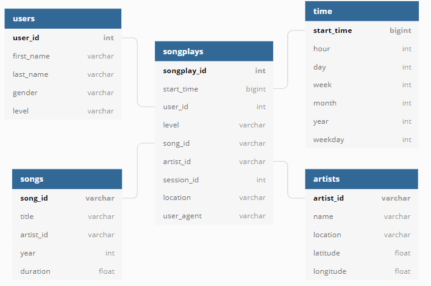

# 🎵 Sparkify Data Warehouse on Snowflake

> **Note:** This project is an assignment for the **SMIT Cloud Data Engineering (Batch 2)** program, designed to showcase skills in building a cloud-based data warehouse.

Welcome to the Sparkify Data Warehouse project! This is where music streaming meets cloud data engineering. For Sparkify, a fictional music streaming startup, we’re building a scalable, high-performance data warehouse using **Snowflake** to analyze user activity and song metadata. From user engagement to trending tracks, this project unlocks insights through a robust ELT (Extract, Load, Transform) pipeline, optimized with a star schema for blazing-fast queries.

By using Snowflake’s cloud-native architecture, we leverage seamless data loading, powerful transformations, and elastic scaling. Let’s dive into the rhythm of data!

---

## 📁 Project Structure

```
Sparkify-data-warehousing/
│
├── README.md                 # Project documentation
├── images/                   # Architecture and schema diagrams
│   ├── architecture.PNG      # Visual of the cloud data pipeline
│   └── schema.PNG            # Star schema diagram
├── data/                     # Sample datasets
│   ├── log_data/             # User activity event logs (JSON)
│   │   ├── 2018-11-01-events.json
│   │   ├── 2018-11-02-events.json
│   │   └── ...
│   └── song_data/            # Song metadata (JSON)
│       └── A/
│           ├── A/
│           └── B/
└── code.sql        # SQL script for setup, staging, and transformations
```

---

## 🎶 Datasets Description

The project uses two JSON datasets stored in **AWS S3**, simulating real activity from the Sparkify app: **Song Data** and **Log Data (Events)**.

### 1. Song Data
Metadata about songs and their artists, stored in nested JSON files.

**Example Structure:**
```json
{
  "num_songs": 1,
  "artist_id": "ARJIE2Y1187B994AB7",
  "artist_latitude": null,
  "artist_longitude": null,
  "artist_location": "",
  "artist_name": "Line Renaud",
  "song_id": "SOUPIRU12A6D4FA1E1",
  "title": "Der Kleine Dompfaff",
  "duration": 152.92036,
  "year": 0
}
```

**Key Fields:**
| Field | Description |
|-------|-------------|
| `song_id` | Unique song identifier |
| `title` | Song title |
| `artist_id` | Foreign key reference to artist |
| `artist_name` | Artist name |
| `year` | Song release year |
| `duration` | Song duration in seconds |

### 2. Log Data (Event Data)
User activity logs capturing events like song plays, logins, and sessions.

**Example Structure:**
```json
{
  "artist": "Pavement",
  "auth": "Logged In",
  "firstName": "Sylvie",
  "gender": "F",
  "itemInSession": 0,
  "lastName": "Cruz",
  "length": 99.16036,
  "level": "free",
  "location": "Washington-Arlington-Alexandria, DC-VA-MD-WV",
  "method": "PUT",
  "page": "NextSong",
  "registration": 1540266185796.0,
  "sessionId": 345,
  "song": "Mercy:The Laundromat",
  "status": 200,
  "ts": 1541990258796,
  "userAgent": "\"Mozilla/5.0 ...\"",
  "userId": "10"
}
```

**Key Fields:**
| Field | Description |
|-------|-------------|
| `userId` | Unique user ID |
| `firstName`, `lastName`, `gender` | User details |
| `level` | User subscription level (free/paid) |
| `song`, `artist`, `length` | Song being played |
| `sessionId` | Session ID for the event |
| `location` | User location |
| `ts` | Timestamp (in milliseconds) |

---

## 🏗️ Architecture

The project leverages a modern cloud data stack for scalability and performance:

| Component          | Role |
|--------------------|------|
| **AWS S3**        | Stores raw JSON song and log data. |
| **Snowflake Stages** | External references to S3 buckets for seamless data access. |
| **Snowflake Compute** | Virtual Warehouses execute SQL for data loading and transformation. |
| **Snowflake DWH** | Hosts the optimized star schema for analytical queries. |


---

## 🧩 Data Model: Star Schema

The data warehouse uses a **star schema** to optimize analytical queries, with one central fact table and four dimension tables.

### Fact Table
- **songplays**: Captures every song play event, linking user activity to song metadata. The core of our analytics!

### Dimension Tables
- **users**: Details about Sparkify’s users (e.g., ID, name, gender, subscription level).
- **songs**: Song metadata (e.g., ID, title, duration, year).
- **artists**: Artist info (e.g., ID, name, location).
- **time**: Timestamp breakdowns (hour, day, week, month, year) for time-based analysis.



This schema ensures fast joins and intuitive querying for insights like top songs, user trends, or peak listening hours.

---

## 🔄 ELT Pipeline: How It Works

The pipeline is built with SQL, harnessing Snowflake’s semi-structured data capabilities and internal stages for an efficient ELT workflow.

### 1. Data Sources
- **Song Data**: Static metadata about songs and artists (JSON in S3).
- **Log Data**: User events like song plays, logins, and sessions (JSON in S3).

### 2. Staging Layer (Extract & Load)
- **Stages**: Named external stages (@song_stage, @log_stage) point to S3 paths.
- **File Format**: JSON file format for parsing raw data.
- **Staging Tables**: Temporary tables (staging.song_data, staging.log_data) use a single VARIANT column for schema-on-read flexibility.
- **Copy Data**: Use `COPY INTO` to load JSON files into staging tables rapidly.

### 3. Data Warehouse Layer (Transform)
SQL transformations in the `dwh` schema create the star schema:
- **Dimensions**:
  - Extract data from VARIANT columns, cast to appropriate types (e.g., ::INT, ::VARCHAR).
  - Deduplicate using `GROUP BY`.
  - For **time**, use `TO_TIMESTAMP()` and `EXTRACT()` to break down Unix timestamps (ts) into granular units.
- **Fact Table (songplays)**:
  - Perform a `LEFT JOIN` between `staging.log_data` and `staging.song_data` on song title and artist name.
  - Filter for `page = 'NextSong'` events.
  - Assign an `AUTOINCREMENT` surrogate key for uniqueness.

The result? A query-ready star schema for powerful analytics!

---

## 🛠️ Project Code Files

The entire pipeline is implemented in a single SQL script:
- **code.sql**:
  - Creates databases and schemas.
  - Defines stages and JSON file formats.
  - Executes `COPY INTO` for staging tables.
  - Includes `CREATE TABLE` and `INSERT INTO` for dimension tables (users, songs, artists, time).
  - Builds the `songplays` fact table with join logic.

---

## ✅ Prerequisites

To run this project, you’ll need:
- An **AWS account** with an S3 bucket containing Sparkify’s `log_data` and `song_data` JSON files.
- A **Snowflake account** with a configured Virtual Warehouse.
- **AWS Access Key ID** and **Secret Access Key** set up in Snowflake for secure S3 access.

---

## 🎯 Learning Objectives

This project demonstrates key cloud data engineering skills:
- Building a cloud-based data warehouse using **Snowflake**.
- Designing an optimized **star schema** for analytical queries.
- Implementing an **ELT pipeline** with JSON data.
- Mastering **data modeling** and **metadata management** in cloud environments.
- Leveraging **AWS S3** and Snowflake for scalable data workflows.

---

## 📝 Project Assignment

This project is part of the **SMIT Cloud Data Engineering (Batch 2)** curriculum, showcasing practical application of data warehousing concepts using modern cloud technologies like **Snowflake** and **AWS S3**. It’s designed to prepare for real-world data engineering challenges.

---

## 🚀 Get Started

1. Set up your AWS S3 bucket with the provided `log_data` and `song_data`.
2. Configure Snowflake with a Virtual Warehouse and S3 access credentials.
3. Run `dwh_sql_script.sql` to build the warehouse.
4. Query away to uncover insights like top artists, user behavior, or peak listening times!

Questions? Want to jam on some data insights? Reach out and let’s make some noise with Sparkify! 🎧

---

## 📜 License

This is an educational project for learning purposes, created as part of the SMIT Cloud Data Engineering (Batch 2) program.
```
